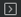

# Arm Device Manager

## Overview

This extension allows you to manage device connections for Arm Cortex-M based microcontrollers, development boards and debug probes.

## Useful resources

The **Arm Device Manager** extension can work in combination with the **Arm CMSIS csolution** (Identifier: `arm.cmsis-csolution`) and **Arm Embedded Debugger** (Identifier: `arm.embedded-debug`) extensions to flash csolution projects to a device and undertake debugging.

## Submit feedback

To submit feedback, please [create an issue](https://github.com/Arm-Software/vscode-device-manager/issues/new/choose).

## Add devices

Procedure:

1. Click the **Device Manager** icon  in the Activity Bar to open the extension.

1. Connect your device to your computer over USB.

    The device is detected and a popup message displays.

1. Click **OK** in the pop up message to use the device.

    Alternatively, you can click the **Add Device** button  and select your device in the drop-down list that displays at the top of the window.

    Your device is now ready to be used for flashing and debugging.

If you need to add more devices, click the **Add Device** icon  in the top right corner.

## Rename a device

Procedure:

1. Hover over the device you want to rename and click the **Rename Device** icon .

1. Enter a name for the device and press **Enter**.

## Open a serial monitor

Procedure:

1. Hover over the device for which you want to open a serial monitor and click the **Open Serial** icon .

    A drop-down list displays at the top of the window where you can select a baud rate (the data rate in bits per second between your computer and your device). To view the output of a device correctly, you must select an appropriate baud rate. The baud rate you select must be the same as the baud rate of your active project.

1. Select a baud rate.

    A **Terminal** tab opens with the baud rate selected.

    <!--Should the Terminal options be documented (DAPLink CMSIS-DAP menu, New Terminal menu,...)? -->
